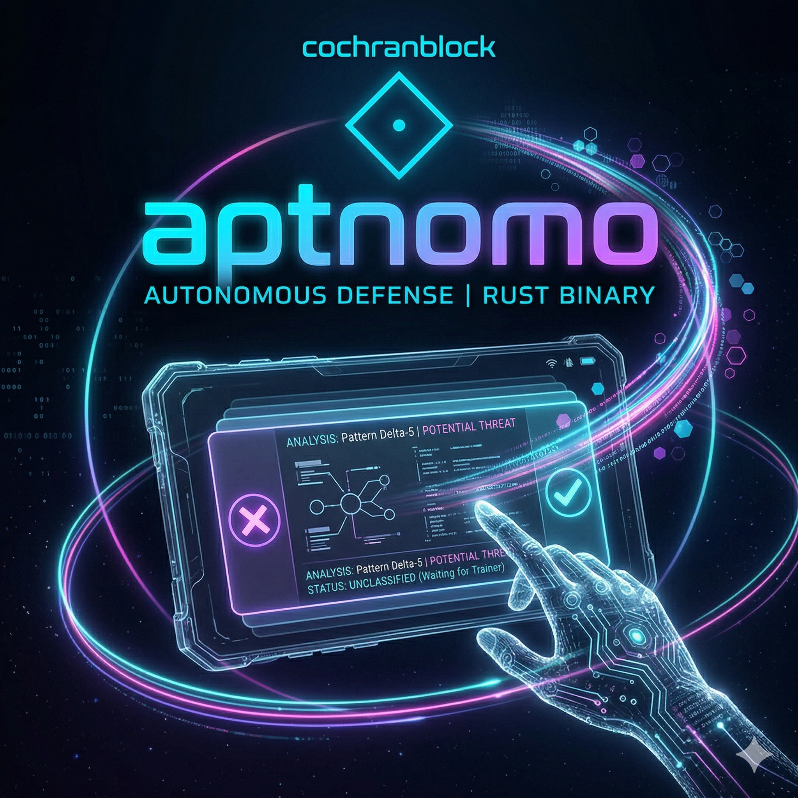

# aptnomo



**Tiny binary autonomous APT threat hunter for bare-metal Linux. Rust. Zero config.**

Drop it on a machine. It watches. It reports. It kills threats when safe to. No CLI to learn, no YAML to write, no cloud to phone home to, no agent platform to maintain.

[](UNLICENSE)
[](Cargo.toml)
[](#test)
[](#binary-size)

---

## What it does

aptnomo is a daemon-mode binary that continuously scans bare-metal Linux systems for Advanced Persistent Threat indicators. It runs in a loop — fast scan on startup (30s interval), then settles to every 5 minutes. When it finds something Critical and the process is safe to terminate, it sends `SIGKILL` automatically. Everything else gets written to a structured store for later review.

Zero config. No `--flag`s required. No environment variables. No telemetry. Just one binary and a sled DB under `~/.aptnomo/`.

## How it works

```
aptnomo starts
    │
    ▼
scan_all() — runs all 8 detection modules
    │
    ▼
threats empty? ──yes──▶ sleep 5m, repeat
    │ no
    ▼
for each threat:
   stderr + /tmp/aptnomo/threats.log
   write ThreatCard → sled (if not duplicate of pending)
    │
    ▼
severity == Critical AND auto_kill AND is_safe_to_kill?
    │ yes                                     │ no
    ▼                                         ▼
SIGKILL the pid                          leave for human review
move card to history (status=AutoKilled)
    │
    ▼
sleep 30s (faster scan after a hit), then repeat
```

### Daemon mode

Run it. Walk away. The daemon writes its PID to `/tmp/aptnomo/pid`, threats to `/tmp/aptnomo/threats.log` and `~/.aptnomo/db/`, and audit-logs every kill to `/tmp/aptnomo/kills.log`. **Silent when clean** — a healthy host produces no output. SIGTERM/SIGINT triggers a clean shutdown that flushes sled and removes the pidfile.

### Structured storage

Threats land in a sled database at `~/.aptnomo/db/` with bincode + zstd compression. Three trees:

| Tree | Contents |
|------|----------|
| `threats` | Pending threat cards awaiting review |
| `history` | Resolved cards (Killed, Baselined, Quarantined, AutoKilled) |
| `baseline` | Learned patterns from GUI right-swipes |

Flat-file output at `/tmp/aptnomo/threats.log` and `/tmp/aptnomo/kills.log` is kept as a fallback. Both rotate at 10 MB to `*.log.old`. If sled fails to open, the daemon continues writing flat files only.

### Auto-kill safety

Before killing any process, aptnomo checks `is_safe_to_kill`:

- Never PID ≤ 2 (init/kthreadd).
- Never user-interactive processes: `vim`, `nano`, `bash`, `zsh`, `fish`, `code`, `chrome`, `firefox`, `tmux`.
- Only fires on `severity == Critical` AND the detection module marked the threat `auto_kill: true`.

Today only `f50_processes` produces `auto_kill: true` threats. Every other module is human-review only.

## Detection modules

| Module | Function | What it detects | Auto-kill |
|--------|----------|-----------------|-----------|
| **Persistence** | `f10_persistence` | systemd units in `/etc/systemd/system` and `/usr/lib/systemd/system` with `ExecStart` paths under `/tmp/` or hidden directories | no |
| **Network**     | `f20_network`     | `/proc/net/tcp` LISTEN sockets on `0.0.0.0` (excludes 22, 80, 443, 8080, 8081, 3000, 3001, 8000) | no |
| **Rootkit**     | `f30_rootkit`     | `/proc/modules` entries containing `hide`, `stealth`, `rootkit`, `backdoor`, `keylog` | no |
| **SSH**         | `f40_ssh`         | `$HOME/.ssh/authorized_keys` count > 5 | no |
| **Processes**   | `f50_processes`   | `/proc/<pid>/cmdline` matches against `cryptominer`, `xmrig`, `stratum`, `reverse_shell`, `nc -e`, `bash -i` | **yes** |
| **Logs**        | `f60_logs`        | Empty `/var/log/{auth.log,syslog,messages}` (possible wipe) | no |
| **Cron**        | `f70_cron`        | Cron files in `/etc/cron.d`, `/var/spool/cron/crontabs`, `/etc/cron.daily` containing `/tmp/`, `curl `, or `wget ` | no |
| **Files**       | `f80_files`       | Hidden executables (>10 KB, exec bit set) in `/tmp`, `/dev/shm`, `/var/tmp` | no |

All eight modules read real system paths every cycle. None of them call out to the network.

## GUI — Tinder for Threats

A second binary (`aptnomo-gui`, behind the `gui` cargo feature) presents pending threats as swipeable cards backed by the same sled DB. No sockets, no IPC — both binaries open the same `~/.aptnomo/db/`.

| Gesture | Action | Sled effect |
|---------|--------|-------------|
| Swipe **RIGHT** | Baseline (learn this pattern, stop alerting) | `resolve → Baselined`; `BaselinePattern` written to `baseline` tree |
| Swipe **LEFT**  | Kill (`SIGKILL` if pid > 2)                  | `resolve → Killed`   |
| Swipe **UP**    | Quarantine (`SIGSTOP` if pid > 2)            | `resolve → Quarantined` |

Built with [egui](https://github.com/emilk/egui). Polls sled once per second. See [`docs/GUI_DESIGN.md`](docs/GUI_DESIGN.md) for the full UX spec.

### Card colors

| Severity | Border    | Fill      | Meaning |
|----------|-----------|-----------|---------|
| Green    | `#50b432` | `#2d5a2d` | Informational — new but likely benign |
| Yellow   | `#d4d432` | `#5a5a2d` | Unusual — worth a glance |
| Orange   | `#ff7814` | `#5a3a1a` | Suspicious — likely needs action |
| Red      | `#c83232` | `#5a1a1a` | Critical — auto-killed; review the audit log |

## Architecture

```
src/
├── lib.rs                  — crate root: re-exports types, store
├── types.rs                — ThreatCard, BaselinePattern, Module, Severity, CardStatus, Stats
├── store.rs                — sled DB layer (bincode + zstd, 3 trees)
├── main.rs                 — daemon: scan loop, signal handling, 8 detection modules
└── bin/
    ├── aptnomo-gui.rs      — egui swipe-card review interface (feature: gui)
    └── aptnomo-test.rs     — exopack TRIPLE SIMS quality gate (feature: tests)
```

| Binary         | Cargo feature | Release size       | Purpose |
|----------------|---------------|--------------------|---------|
| `aptnomo`      | (default)     | ~980 KB stripped   | Headless daemon |
| `aptnomo-gui`  | `gui`         | ~3.5 MB stripped   | Threat review UI |
| `aptnomo-test` | `tests`       | —                  | Triple-pass quality gate |

## Binary size

The release profile in `Cargo.toml`:

```toml
[profile.release]
opt-level    = "z"      # size-first (shrink over speed)
lto          = true     # link-time dead-code strip
codegen-units = 1
panic        = "abort"
strip        = true
```

Result: a fully-functional daemon binary under 1 MB on x86_64-linux. Measured against `target/release/aptnomo` after `cargo build --release`.

## Install

```sh
cargo install --path .
```

Or build from source:

```sh
cargo build --release                  # daemon only (~980 KB)
cargo build --release --features gui   # daemon + GUI
```

## Usage

```sh
# Just run it. That's it. Zero config.
./target/release/aptnomo

# It will:
#   - Print version and PID on startup
#   - Open sled DB at ~/.aptnomo/db/
#   - Scan all 8 modules every 30s (first pass) then every 5m
#   - Log threats to /tmp/aptnomo/threats.log + sled
#   - Auto-kill Critical processes when safe
#   - Run forever until SIGTERM/SIGINT

# Launch the GUI to review threats:
./target/release/aptnomo-gui

# Tail the audit log:
tail -f /tmp/aptnomo/kills.log
```

To run as a system service, point a systemd unit (or launchd plist on macOS once macOS backends land — see [BACKLOG.md](BACKLOG.md)) at the binary. No config file. No env vars.

## Test

```sh
cargo test                                       # 123 unit tests across lib + main bin
cargo clippy --all-targets --features gui        # zero warnings is the bar
cargo run --bin aptnomo-test --features tests    # exopack TRIPLE SIMS — 3 runs, all must pass
```

The test binary IS the CI pipeline. There's no external test framework. Detection-module tests are written so they pass on both Linux (where `/proc` exists) and macOS (where it doesn't); the modules return empty `Vec`s rather than panicking when system paths are missing.

## Triple Lens

All aptnomo work is evaluated through the [cochranblock](https://cochranblock.org) Triple Lens quality gate:

- **Lens 1 (Technical):** Compiles clean, clippy clean, 123 unit tests passing, TRIPLE SIMS 3/3, daemon + GUI both build clean.
- **Lens 2 (Product):** Solves a real problem — autonomous APT detection on bare metal with zero config, zero cloud, zero telemetry, zero agent infrastructure. Drop and run.
- **Lens 3 (Honest):** Every detection module reads real system paths. Binary sizes are measured, not claimed. SBOM and supply-chain audit live in `govdocs/`. Every commit hash is in `TIMELINE_OF_INVENTION.md`.

## Roadmap

See [BACKLOG.md](BACKLOG.md) for the prioritized work queue. Top of the list right now:

1. Fix `f50` reverse-shell signature matching (NUL-delimited cmdline bug).
2. Make the daemon honor learned baselines so right-swipes actually suppress future alerts.
3. macOS detection backends (launchd, lsof, kextstat).

## Project files

| File | Purpose |
|------|---------|
| [`CLAUDE.md`](CLAUDE.md) | Build/test commands and module map for Claude Code sessions |
| [`BACKLOG.md`](BACKLOG.md) | Prioritized work queue |
| [`TIMELINE_OF_INVENTION.md`](TIMELINE_OF_INVENTION.md) | Commit-anchored development log |
| [`PROOF_OF_ARTIFACTS.md`](PROOF_OF_ARTIFACTS.md) | Reproducibility receipts |
| [`docs/GUI_DESIGN.md`](docs/GUI_DESIGN.md) | Swipe-card UX spec |
| [`docs/compression_map.md`](docs/compression_map.md) | Function/type token map |
| [`govdocs/`](govdocs) | SBOM, supply-chain audit, license inventory |

## License

[Unlicense](UNLICENSE) — public domain. [cochranblock.org](https://cochranblock.org)
